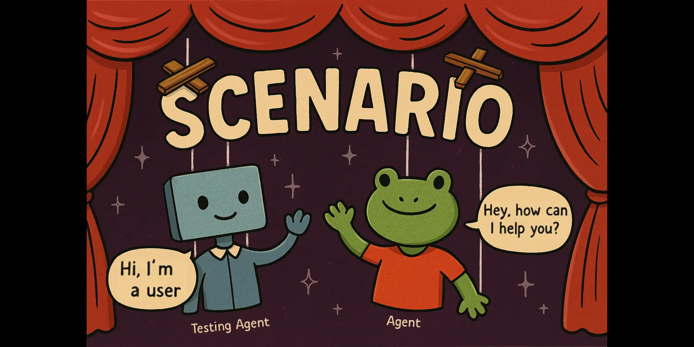

<p align="center">
	<a href="https://discord.gg/kT4PhDS2gH" target="_blank"></a>
	<a href="https://pypi.python.org/pypi/langwatch-scenario" target="_blank"></a>
	<a href="https://www.npmjs.com/package/@langwatch/scenario" target="_blank"></a>
	<a href="https://twitter.com/intent/follow?screen_name=langwatchai" target="_blank">
	</a>
</p>

# Scenario: Agent Testing Framework

Scenario is a powerful testing framework designed for AI agents, enabling comprehensive testing through simulated interactions. Available in both Python and TypeScript, it provides a unified approach to testing your AI agents regardless of your tech stack.

## Key Features

- 🎭 **Realistic Testing**: Test real agent behavior by simulating users in different scenarios and edge cases
- 🎯 **Multi-turn Control**: Evaluate and judge at any point of the conversation with powerful control mechanisms
- 🔌 **Framework Agnostic**: Combine with any LLM eval framework or custom evals - designed to be flexible
- 🚀 **Simple Integration**: Implement just one `call()` method to integrate your agent
- 🌐 **Multi-language Support**: Available in Python and TypeScript with consistent APIs

[📺 Watch Video Tutorial](https://www.youtube.com/watch?v=f8NLpkY0Av4)

## Quick Start - Python

```bash
pip install pytest langwatch-scenario
```

Create your first test (`tests/test_agent.py`):

```python
import pytest
import scenario
import litellm

scenario.configure(default_model="openai/gpt-4.1-mini")

@pytest.mark.agent_test
@pytest.mark.asyncio
async def test_vegetarian_recipe_agent():
    class Agent(scenario.AgentAdapter):
        async def call(self, input: scenario.AgentInput) -> scenario.AgentReturnTypes:
            return vegetarian_recipe_agent(input.messages)

    result = await scenario.run(
        name="dinner idea",
        description="User needs a vegetarian recipe for dinner",
        agents=[
            Agent(),
            scenario.UserSimulatorAgent(),
            scenario.JudgeAgent(
                criteria=[
                    "Recipe should include ingredients list",
                    "Recipe should include step-by-step instructions",
                    "Recipe should be vegetarian"
                ]
            ),
        ],
    )

    assert result.success

@scenario.cache()
def vegetarian_recipe_agent(messages):
    response = litellm.completion(
        model="openai/gpt-4.1-mini",
        messages=[
            {
                "role": "system",
                "content": "You are a vegetarian recipe agent. Provide complete recipes with ingredients and instructions.",
            },
            *messages,
        ],
    )
    return response.choices[0].message
```

Run with:
```bash
pytest -s tests/test_agent.py
```

<details>
<summary><strong>Quick Start - TypeScript</strong></summary>

Install the package:
```bash
# Using npm
npm install @langwatch/scenario

# Using pnpm (recommended)
pnpm add @langwatch/scenario

# Using yarn
yarn add @langwatch/scenario
```

Create your first test:
```typescript
import scenario, { TestableAgent } from "@langwatch/scenario";

class MyAgent implements TestableAgent {
  async invoke(message: string): Promise<{ message: string }> {
    // Your agent implementation here
    return { message: "Recipe response..." };
  }
}

const result = await scenario.run({
  name: "vegetarian recipe agent",
  description: "User wants a vegetarian dinner recipe",
  agents: [
    new MyAgent(),
    scenario.userSimulatorAgent(),
    scenario.judgeAgent({
      criteria: [
        "Recipe has step-by-step instructions",
        "Recipe does not contain meat or fish",
      ],
    })
  ]
});

if (result.verdict === "success") {
  console.log("Test passed!");
} else {
  console.log("Test failed:", result.reasoning);
}
```
</details>

## Contributing

We welcome contributions! Please see our [Contributing Guide](CONTRIBUTING.md) for details.

## License

MIT License - see [LICENSE](LICENSE) for details.

## Support

- 📖 [Documentation](https://docs.langwatch.ai)
- 💬 [Discord Community](https://discord.gg/langwatch)
- 🐛 [Issue Tracker](https://github.com/langwatch/scenario/issues)
